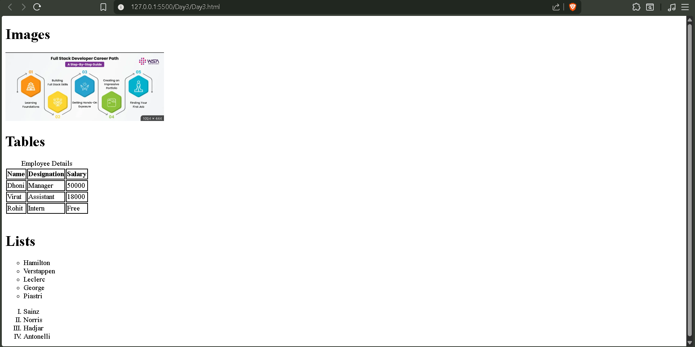
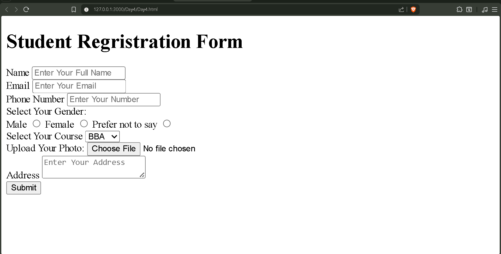
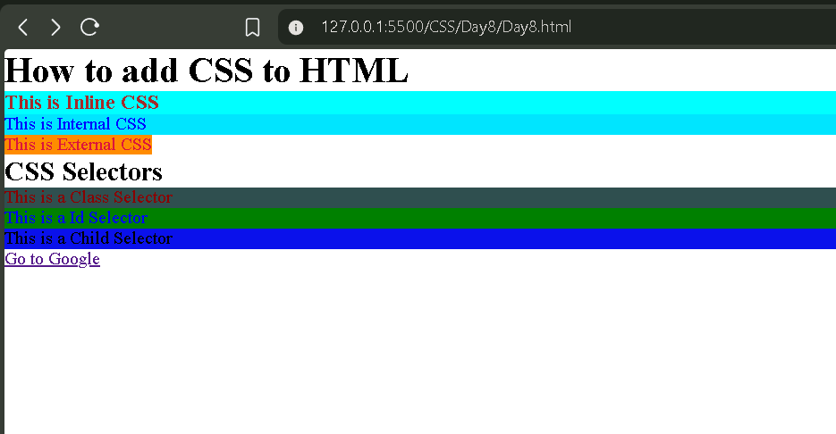

# My Web Development Journey 

## Day 1

* Learned HTML basics
* Basic structure of webpage
* Boilerplate code & Emmet
* Linking CSS & JavaScript

Built:

* My first HTML page

## Day 2 of My Web Development Journey

Today I learned:

* Heading tags (h1–h6)
* Paragraph tag
* Anchor tag & links

Built:

* A simple webpage with headings and a clickable link

* Created my first working link 🔗http://127.0.0.1:5500/Day2/Day2.html
  
## Day 3

- Learned images in HTML  
- Lists (ordered & unordered)  
- Tables  
- Basics of SEO & Core Web Vitals  

Built:
- A webpage with image, list, and table  

## Day 4

- Learned inline vs block elements  
- Forms and input tags  

Built:
- Student registration form  

## Day 5

- Learned IDs and Classes in HTML  
- Video tag  
- Audio tag  
- Iframe tag  

Built:
- A simple webpage using media elements  

## Day 6

- Learned semantic tags in HTML  
- Created multiple video & audio elements  
- Learned HTML entities and code tags  

Built:
- Final HTML practice project  

Milestone:
- Completed HTML basics 🎉  

## Day 8

- Started CSS  
- Selectors & declarations  
- Inline, internal, external CSS  
- Class, ID, child, descendant, universal, pseudo selectors  

Built:
- Styled webpage using different CSS methods  

