# My Web Development Journey 

## Day 1

* Learned HTML basics
* Basic structure of webpage
* Boilerplate code & Emmet
* Linking CSS & JavaScript

Built:

* My first HTML page

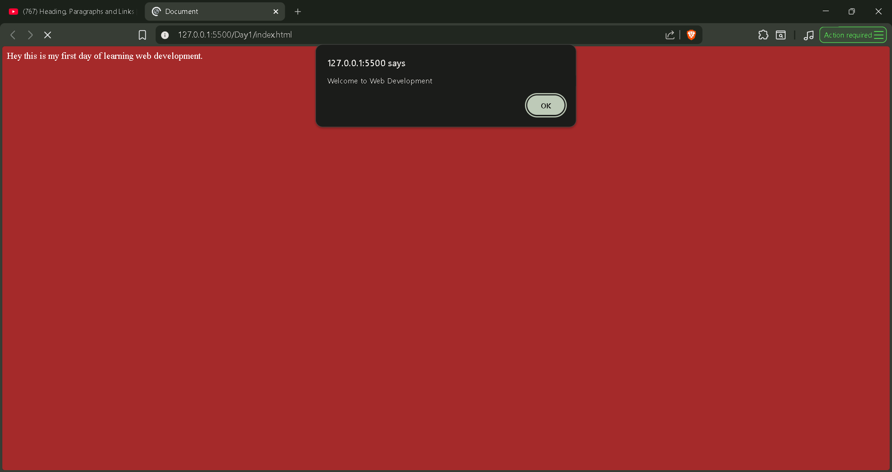

## Day 2 of My Web Development Journey

Today I learned:

* Heading tags (h1–h6)
* Paragraph tag
* Anchor tag & links

Built:

* A simple webpage with headings and a clickable link

* Created my first working link 🔗http://127.0.0.1:5500/Day2/Day2.html
  
## Day 3

- Learned images in HTML  
- Lists (ordered & unordered)  
- Tables  
- Basics of SEO & Core Web Vitals  

Built:
- A webpage with image, list, and table  

## Day 4

- Learned inline vs block elements  
- Forms and input tags  

Built:
- Student registration form  

## Day 5

- Learned IDs and Classes in HTML  
- Video tag  
- Audio tag  
- Iframe tag  

Built:
- A simple webpage using media elements  

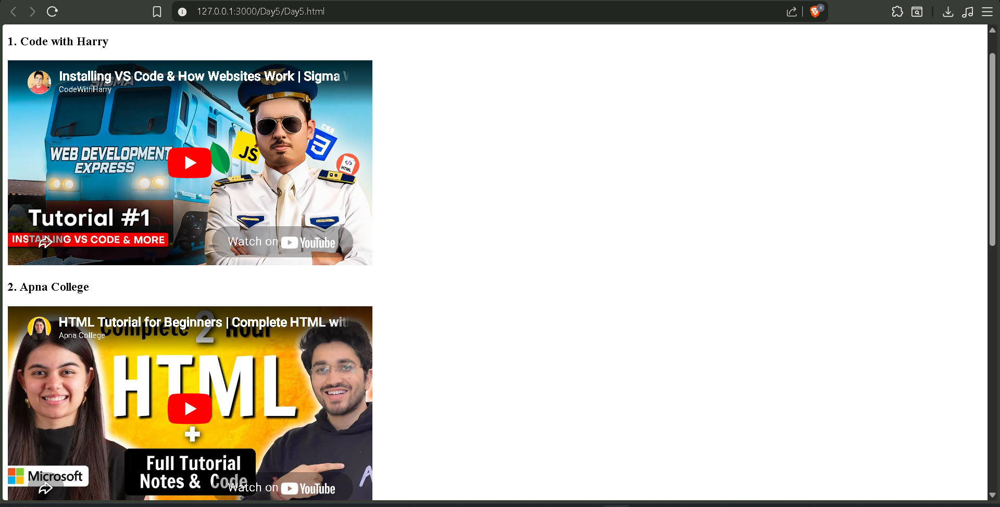

## Day 6

- Learned semantic tags in HTML  
- Created multiple video & audio elements  
- Learned HTML entities and code tags  

Built:
- Final HTML practice project  

Milestone:
- Completed HTML basics 🎉  

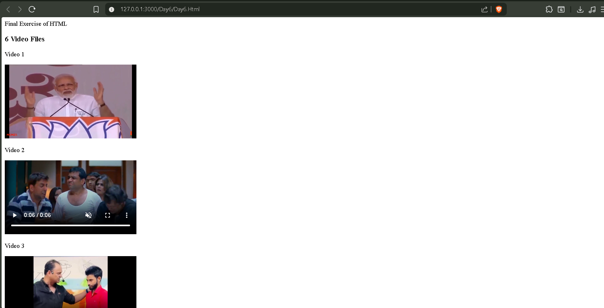

## Day 8

- Started CSS  
- Selectors & declarations  
- Inline, internal, external CSS  
- Class, ID, child, descendant, universal, pseudo selectors  

Built:
- Styled webpage using different CSS methods  

## Day 9

- CSS box model (margin, padding, border, width)  
- Typography (font, text styling)  
- Colors (hex, rgb, hsl)  

Built:
- Personal profile page with styling  

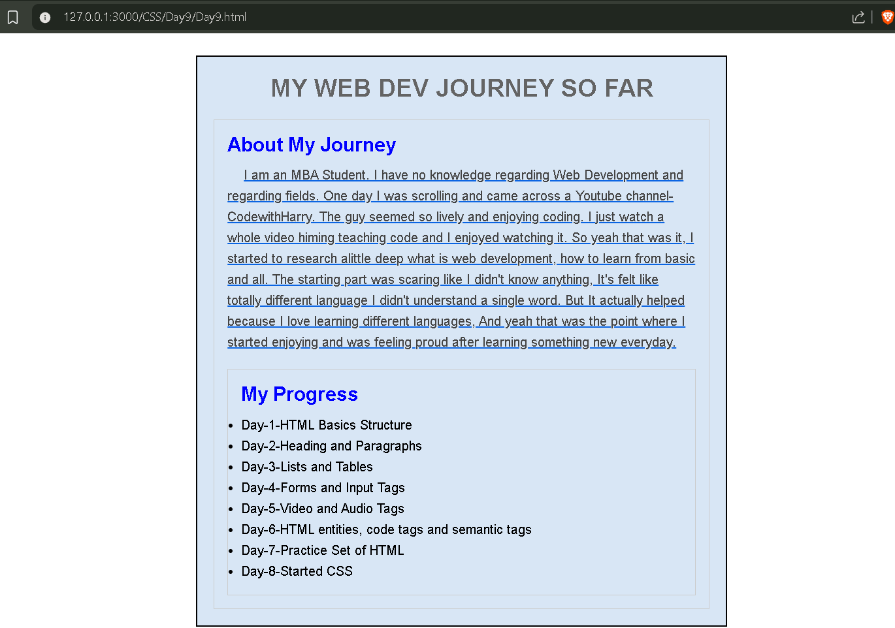

## Day 10

- CSS cascade algorithm  
- CSS sizing units (px, vw, vh, em, rem, %)  

Built:
- Responsive card layout using CSS  

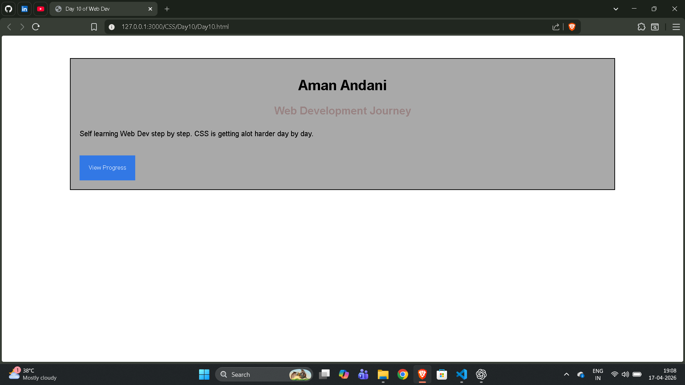

## Day 11

- CSS display (block, inline, inline-block, none)  
- Difference between display and visibility  
- Box shadow and outline  

Built:
- Improved UI with shadows and display properties  

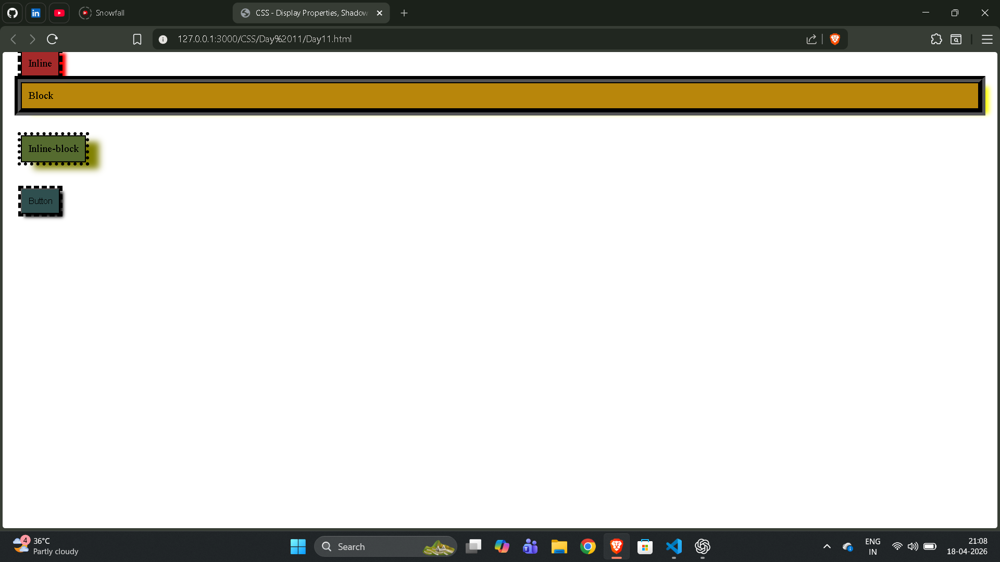

## Day 12

- CSS list styling  
- Overflow properties (hidden, scroll, auto)  

Built:
- Styled list and overflow container inside UI  

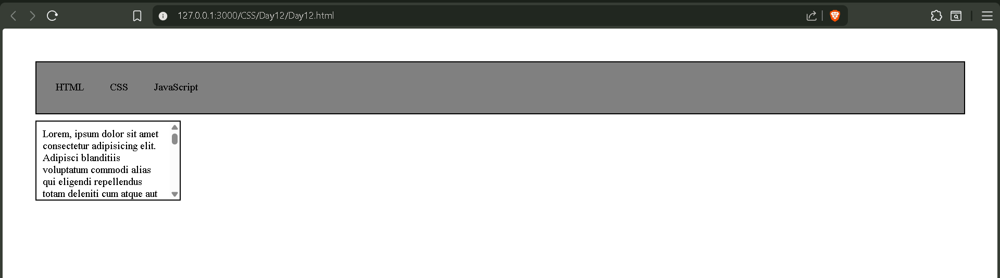

## Day 13

- CSS position (relative, absolute, fixed)

Built:
- Card layout with image, tags and button

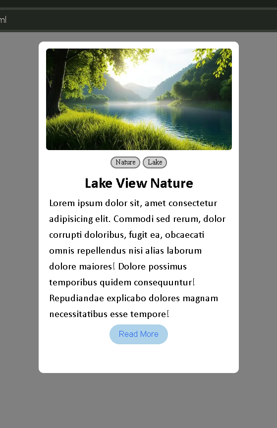

## Day 14

- CSS variables  
- Media queries  
- Responsive card layout  

Built:
- Multi-card responsive layout with overflow and styled lists  

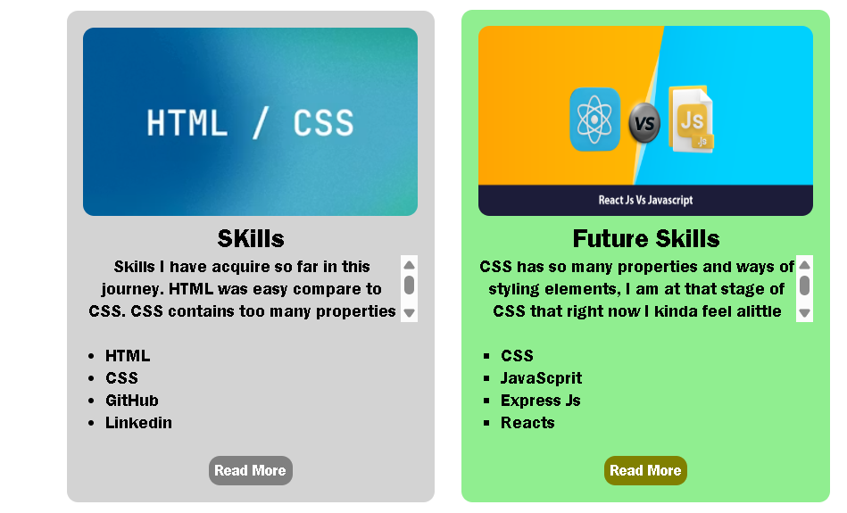

## Day 15

- CSS float and clear  
- Advanced CSS selectors  

Built:
- Multi-section webpage layout using float and positioning 

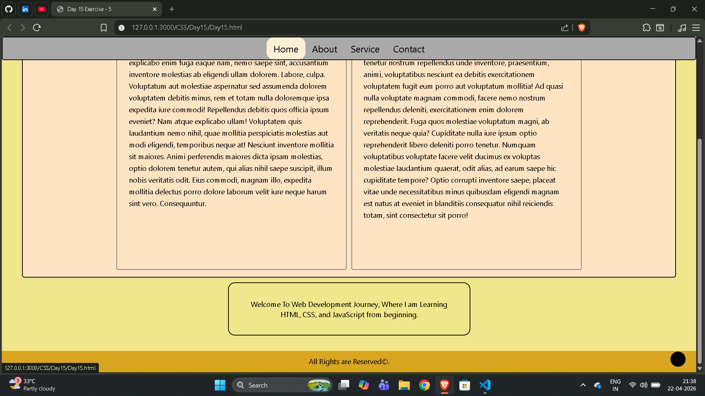

## Day 16

- Flexbox fundamentals  
- justify-content & align-items  
- flex-direction & flex-wrap  

Built:
- Navbar and card layout using Flexbox  

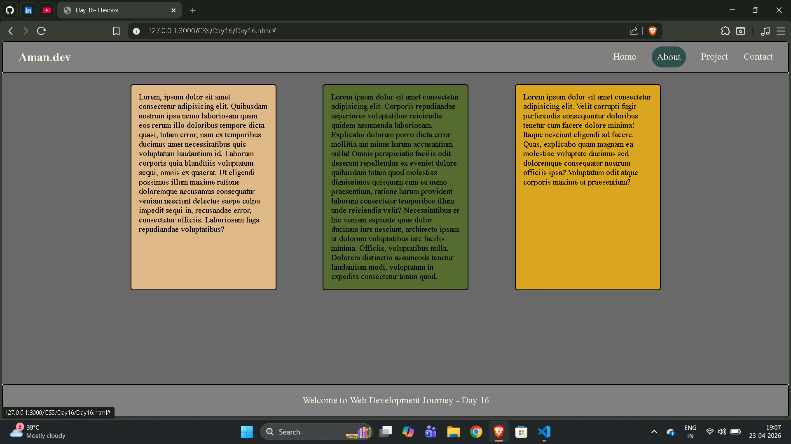

## Day 17

- Learned CSS Grid basics  
- Practiced layout by cloning a real website  

Built:
- Website clone layout  
- Basic grid layout practice  

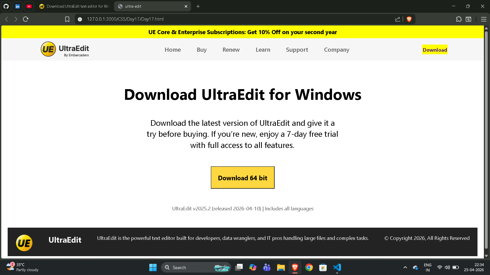

## Day 18

- Practiced CSS Grid deeply  
- Built layout with sidebar, hero section, and cards  

Built:
- Full page layout using grid (no flex)

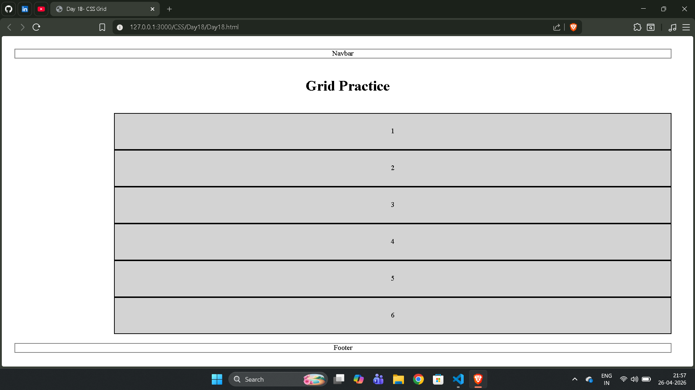

## Day 19

- Revised CSS Grid carefully  
- Practiced building structured layouts using Grid  

Built:
- UltraEdit download page clone using CSS Grid

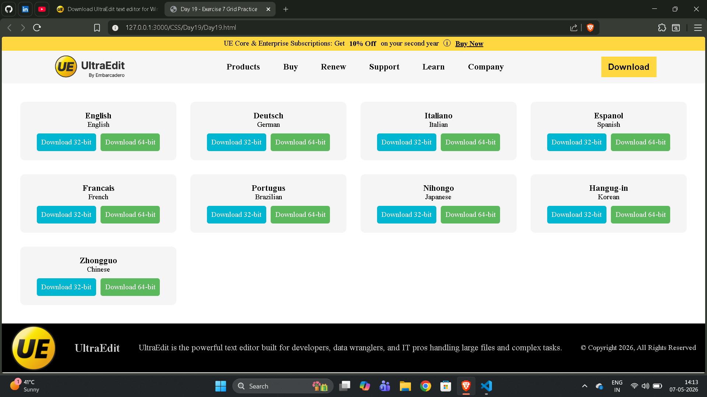

## Day 20

- CSS transform and transition  
- Hover effects and smooth animations  

Built:
- Interactive card with button hover effects and transitions

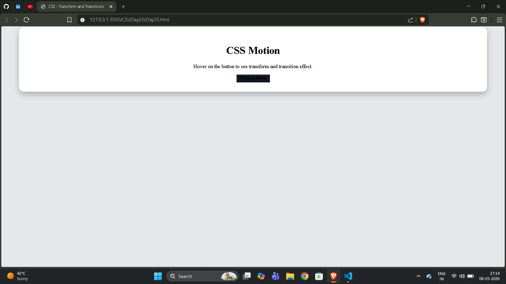

## Day 21

- CSS animations and keyframes
- Transform and transition effects
- Smooth hover interactions

Built:
-Animated card and bounce ball animation
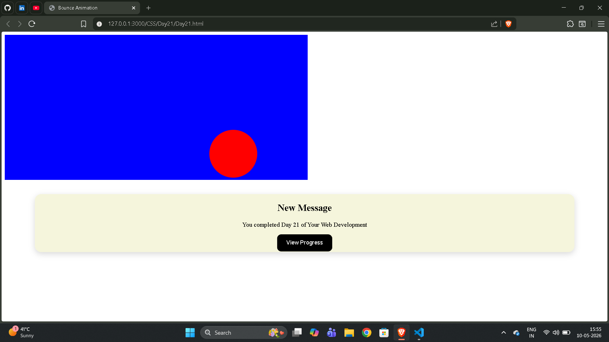
